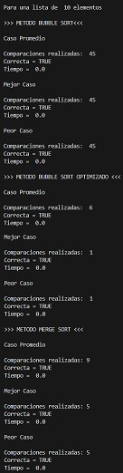

# Sorting Algorithms Performance Analysis

Performance comparison of three classical sorting algorithms implemented in Python: **Bubble Sort**, **Optimized Bubble Sort**, and **Merge Sort**.

The program generates random datasets, executes each algorithm under different scenarios (average, best, and worst case), measures execution times, counts comparisons, and verifies that the resulting arrays are correctly sorted.

---

## Features

- Bubble Sort implementation.
- Optimized Bubble Sort with early termination.
- Merge Sort implementation using the divide-and-conquer strategy.
- Automatic generation of random integer arrays.
- Execution time measurement.
- Comparison counting.
- Validation of sorting correctness.
- Evaluation of average, best, and worst-case scenarios.

---

## Algorithms Included

### Bubble Sort

Bubble Sort repeatedly compares adjacent elements and swaps them whenever they are in the wrong order. Although simple to understand and implement, it is inefficient for large datasets.

**Time Complexity**

| Case | Complexity |
|------|------------|
| Best | O(n²) |
| Average | O(n²) |
| Worst | O(n²) |

---

### Optimized Bubble Sort

This version introduces a flag that detects whether any swaps were performed during a pass. If no swaps occur, the algorithm stops because the list is already sorted.

**Time Complexity**

| Case | Complexity |
|------|------------|
| Best | O(n) |
| Average | O(n²) |
| Worst | O(n²) |

---

### Merge Sort

Merge Sort follows the divide-and-conquer paradigm by recursively splitting the array into smaller subarrays and merging them back in sorted order.

**Time Complexity**

| Case | Complexity |
|------|------------|
| Best | O(n log n) |
| Average | O(n log n) |
| Worst | O(n log n) |

---

## Project Structure

```
Sorting-Algorithms-Performance-Analysis/
│
├── assets/
│   └── images/
│       ├── execution_example.jpg
│       ├── bubble_sort_average_case.jpg
│       ├── bubble_sort_optimized.jpg
│       └── merge_sort.jpg
│
├── src/
│   └── sorting_algorithms.py
│
├── .gitignore
├── LICENSE
└── README.md
```

---

## Screenshots

### Complete Program Execution



Complete execution of the application comparing Bubble Sort, Optimized Bubble Sort, and Merge Sort, including execution times, comparison counts, and correctness verification.

---

### Bubble Sort


Bubble Sort execution showing the average-case behavior, execution time, comparison count, and sorting validation.

---

### Optimized Bubble Sort


Execution of the optimized Bubble Sort algorithm using an early-exit mechanism to reduce unnecessary iterations.

---

### Merge Sort


Merge Sort execution demonstrating the divide-and-conquer strategy, execution time, comparison count, and correctness verification.

---

## Requirements

- Python 3.x

No external libraries are required. The program only uses Python standard libraries:

- random
- math
- time

---

## How to Run

1. Clone the repository.

```bash
git clone https://github.com/your-username/Sorting-Algorithms-Performance-Analysis.git
```

2. Navigate to the project directory.

```bash
cd Sorting-Algorithms-Performance-Analysis
```

3. Run the program.

```bash
python src/sorting_algorithms.py
```

---

## Example Output

The program displays:

- Randomly generated arrays.
- Number of comparisons.
- Execution time.
- Verification of sorting correctness.
- Results for:
  - Average case
  - Best case
  - Worst case

for each implemented sorting algorithm.

---

## Educational Purpose

This project was developed as an academic exercise to study and compare classical sorting algorithms, evaluate their computational performance, and analyze their theoretical and practical behavior under different execution scenarios.

---

## Author

**Jose Luis Alva Salazar**

---

## License

This project is licensed under the MIT License. See the **LICENSE** file for more information.
