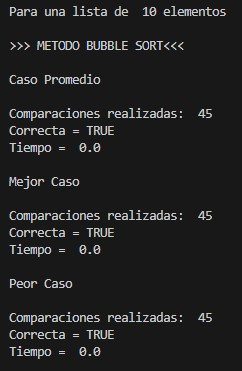
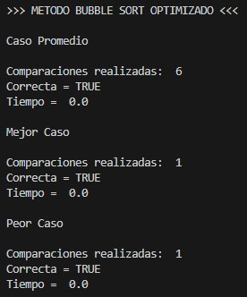
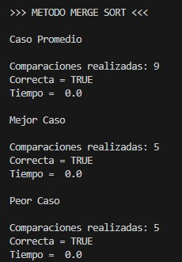

# Sorting Algorithms Performance Analysis

Performance comparison of three classic sorting algorithms implemented in Python:

- Bubble Sort
- Optimized Bubble Sort
- Merge Sort

The project measures execution time, verifies the correctness of each algorithm, and compares their behavior under different input scenarios.

---

## Features

- Bubble Sort implementation
- Optimized Bubble Sort implementation
- Merge Sort implementation
- Execution time measurement
- Comparison counting
- Best, Average and Worst Case evaluation
- Sorted array verification

---

## Algorithms Included

### Bubble Sort

Classic comparison-based sorting algorithm with quadratic complexity.

Average complexity:

O(n²)

---

### Optimized Bubble Sort

Improved version using an early-exit flag to reduce unnecessary iterations when the list is already sorted.

Best case:

O(n)

Worst case:

O(n²)

---

### Merge Sort

Divide-and-conquer sorting algorithm.

Average complexity:

O(n log n)

Worst case:

O(n log n)

---

## Project Structure

```
sorting-algorithms-performance-analysis
│
├── src
│   └── sorting_algorithms_analysis.py
│
├── assets
│   └── images
│
├── LICENSE
├── README.md
└── .gitignore
```

---

## Example Output

### Bubble Sort



---

### Optimized Bubble Sort



---

### Merge Sort



---

## Technologies

- Python 3
- random
- math
- time

---

## Author

Luis Alva

---

## License

This project is licensed under the MIT License.
